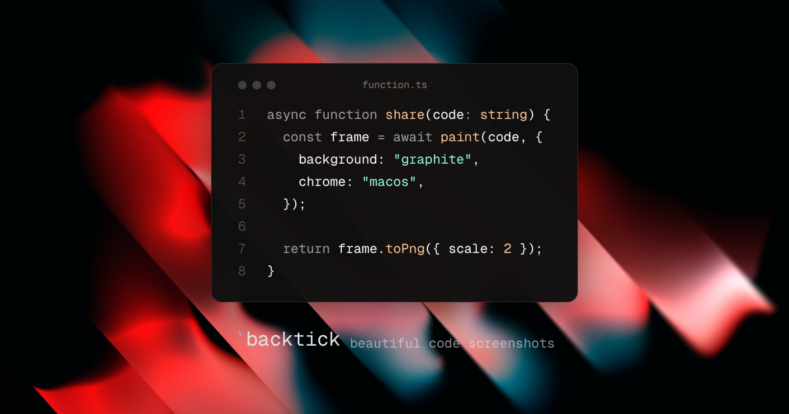

# `backtick

Beautiful code screenshots. Paste a snippet, pick a background, export a pixel-perfect PNG.



## Features

- **Live editor**: type or paste code and watch it re-highlight as you go
- **Real syntax highlighting**: powered by [Shiki](https://shiki.style), with every bundled language and theme, plus a custom Mono theme
- **Backgrounds**: curated gradients and official Raycast wallpapers, or transparent
- **Window chrome**: mono or macOS traffic lights, editable filename, optional line numbers
- **Fine control**: padding, font size, and window opacity sliders
- **Export**: download as 2x PNG or copy the image straight to your clipboard

## Stack

- [Next.js](https://nextjs.org) App Router + React
- [Shiki](https://shiki.style) for highlighting
- [shadcn/ui](https://ui.shadcn.com) + Tailwind CSS
- [html-to-image](https://github.com/bubkoo/html-to-image) for PNG export

## Development

```bash
bun install
bun dev
```

Open [http://localhost:3000](http://localhost:3000).

## Credits

Wallpapers by [Raycast](https://www.raycast.com/wallpapers).
